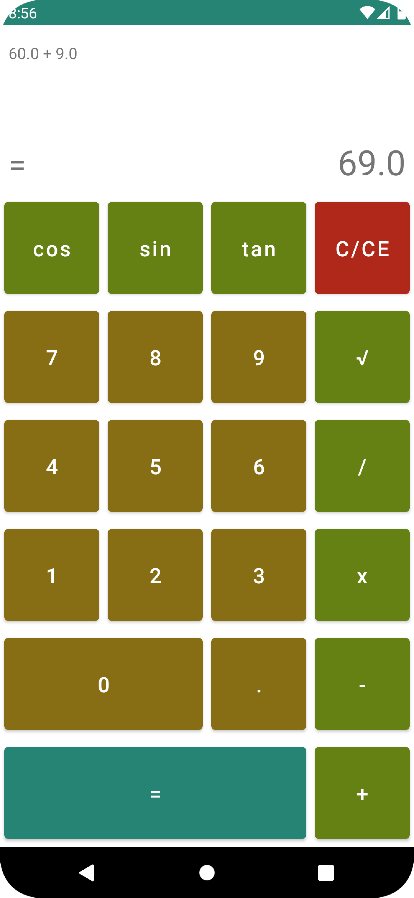

## Basic Calculator

> Basic calculator using Java & XML Layouts

### Made with

- GridLayout
- ConstraintLayout
- Global Styles
- Click Event in Layout style

### Screenshots

- Default view

- Type number

- Add operation result

- `cos` operation result

- `sqrt` operation result

